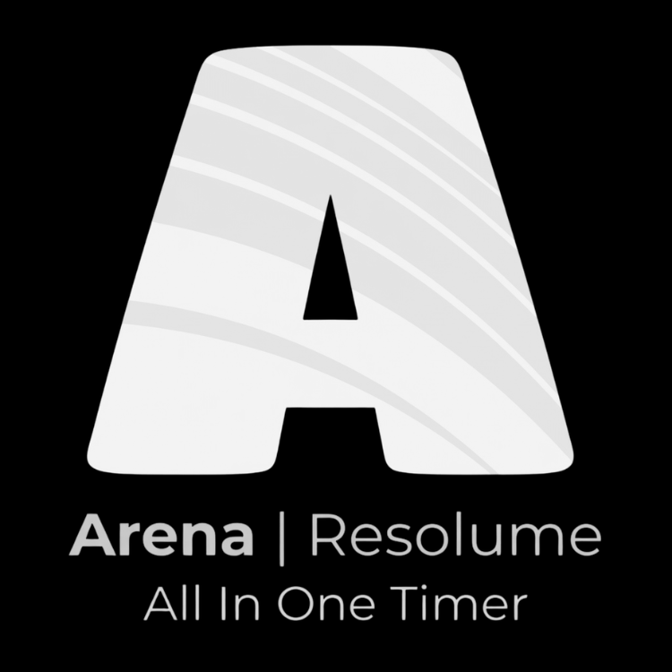
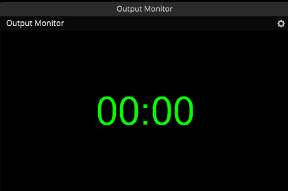
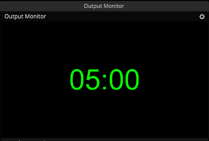
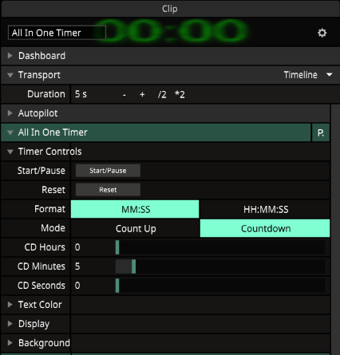
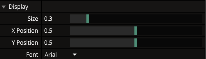
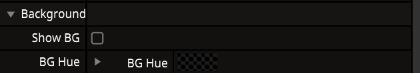

# All In One Timer - FFGL Plugin for Resolume Arena

A customizable stopwatch and countdown timer plugin for Resolume Arena, built with the FFGL 2.1 SDK.



---

## Features

- **Count Up / Countdown modes** - Use as a stopwatch or set a countdown target
- **Time formats** - `MM:SS` or `HH:MM:SS`
- **Intuitive countdown setup** - Separate Hours, Minutes, and Seconds controls
- **System font selection** - Dropdown with all installed Windows fonts (like Resolume's native picker)
- **Native Resolume color picker** - Uses HSB color model for text and background
- **Adjustable size and position** - Full control over placement
- **Optional background** - Toggle a colored background behind the timer
- **Auto-pause** - Timer automatically pauses when the layer is removed from the program output and resumes when it returns
- **High-resolution text rendering** - Crisp, non-pixelated text using GDI + OpenGL textures

---

## Screenshots

### Timer in Action


*The timer displayed in Resolume Arena with default settings*

### Countdown Mode


*Countdown mode with custom time set to 5 minutes*

### Customization Panel


*All available parameters organized in groups: Timer Controls, Text Color, Display, and Background*

### Font Selection


*Dropdown showing all installed system fonts, just like Resolume's native font picker*

### Background Color


*Timer with background enabled and custom color*

---

## Installation

### Option A: Download pre-built DLL (recommended)

1. Go to the [Releases](../../releases) page
2. Download the latest `EventTimer.dll`
3. Copy it to your Resolume Extra Effects folder:
   ```
   C:\Users\<your-user>\Documents\Resolume Arena\Extra Effects\
   ```
4. Restart Resolume Arena
5. Find "All In One Timer" in the Sources list

### Option B: Build from source

#### Prerequisites

- **Visual Studio 2022** (or Build Tools) with C++ workload
- **Windows 10/11 x64**
- **Resolume Arena 7.3.0+** (for testing)

#### Steps

1. Clone the repository:
   ```bash
   git clone https://github.com/rodrmilano00/resolume-all-in-one-timer.git
   cd resolume-all-in-one-timer
   ```

2. Open the solution in Visual Studio:
   ```
   ffgl\build\windows\FFGLPlugins.sln
   ```

3. Select **Release | x64** configuration (important: Debug builds trigger FFGL SDK assertions)

4. Build the solution (`Ctrl+Shift+B`)

5. The post-build event automatically copies `EventTimer.dll` to:
   ```
   C:\Users\<your-user>\Documents\Resolume Arena\Extra Effects\
   ```

6. Restart Resolume Arena

> **Note:** If your Resolume is installed in a different location, update the post-build event in `EventTimer.vcxproj` or manually copy the DLL from `ffgl\binaries\x64\Release\`.

---

## Usage

### Timer Controls

| Parameter | Type | Description |
|-----------|------|-------------|
| Start/Pause | Event (Button) | Starts or pauses the timer |
| Reset | Event (Button) | Resets the timer to zero |
| Format | Dropdown | `MM:SS` or `HH:MM:SS` |
| Mode | Dropdown | `Count Up` (stopwatch) or `Countdown` |
| CD Hours | Slider 0-23 | Countdown target hours |
| CD Minutes | Slider 0-59 | Countdown target minutes |
| CD Seconds | Slider 0-59 | Countdown target seconds |

### Text Color

| Parameter | Type | Description |
|-----------|------|-------------|
| Hue | Color Picker | Text hue (native Resolume HSB) |
| Saturation | Color Picker | Text saturation |
| Brightness | Color Picker | Text brightness |
| Alpha | Color Picker | Text transparency |

### Display

| Parameter | Type | Description |
|-----------|------|-------------|
| Size | Slider 0.05-2.0 | Timer size relative to composition |
| X Position | Slider 0-1 | Horizontal position |
| Y Position | Slider 0-1 | Vertical position |
| Font | Dropdown | Select from installed system fonts |

### Background

| Parameter | Type | Description |
|-----------|------|-------------|
| Show BG | Boolean | Toggle background visibility |
| BG Hue | Color Picker | Background hue |
| BG Sat | Color Picker | Background saturation |
| BG Bright | Color Picker | Background brightness |
| BG Alpha | Color Picker | Background transparency |

### Auto-Pause Behavior

The timer automatically pauses when its layer is removed from the program output (e.g., when switching to a different column). When the layer returns to the program, the timer resumes from where it left off. This prevents the timer from running in the background while not visible.

---

## Project Structure

```
resolume-all-in-one-timer/
├── screenshots/              # Screenshots for README
├── ffgl/
│   ├── source/
│   │   ├── lib/               # FFGL SDK library (Resolume fork)
│   │   │   ├── ffgl/          # Core FFGL SDK
│   │   │   ├── ffglex/        # FFGL extensions (shaders, scoped bindings)
│   │   │   ├── ffglquickstart/ # Quick-start helper classes
│   │   │   └── glsdk_0_5_2/   # OpenGL loader
│   │   └── plugins/
│   │       └── EventTimer/    # All In One Timer plugin source
│   │           ├── FFGLEventTimer.h
│   │           └── FFGLEventTimer.cpp
│   ├── build/
│   │   └── windows/           # Visual Studio project files
│   │       ├── EventTimer.vcxproj
│   │       ├── EventTimer.vcxproj.filters
│   │       ├── FFGLPlugins.sln
│   │       └── FFGLPlugins.def
│   └── binaries/              # Build output (gitignored)
├── .gitignore
└── README.md
```

---

## Contributing

Contributions are welcome! Here's how to get started:

1. **Fork** the repository
2. **Create a feature branch**:
   ```bash
   git checkout -b feature/my-new-feature
   ```
3. **Make your changes** in `ffgl/source/plugins/EventTimer/`
4. **Build in Release mode** to verify it compiles
5. **Test in Resolume Arena** to verify functionality
6. **Commit your changes** with a clear message
7. **Push to your fork** and submit a **Pull Request**

### Guidelines

- Keep the plugin lightweight and performant
- Follow the existing code style (tabs for indentation)
- Test with both Count Up and Countdown modes
- Verify no OpenGL state leaks (build in Debug to check FFGL assertions, but ship in Release)
- If adding new parameters, add them to the appropriate parameter group

### Reporting Issues

When reporting bugs, please include:
- Resolume Arena version
- Windows version
- Steps to reproduce
- Expected vs actual behavior
- Screenshots if applicable

---

## Technical Details

### How It Works

The plugin uses **GDI** (Graphics Device Interface) to render text to a bitmap at high resolution (font size 400px), then uploads the bitmap to an **OpenGL texture**. A simple textured quad is rendered with a custom shader that supports:

- Text color via HSB-to-RGB conversion
- Optional background compositing with alpha blending
- Aspect-ratio-correct positioning

### OpenGL State Management

The plugin carefully manages OpenGL state to avoid conflicts with Resolume's rendering pipeline:

- All texture types are unbound across all texture units at the end of `ProcessOpenGL`
- VAO, VBO, and IBO are unbound after rendering
- Blend state is restored to FFGL defaults (`GL_ONE`, `GL_ZERO`)
- Shader program is unbound via `ScopedShaderBinding` RAII

### Build Configuration

| Configuration | `FFGL_DEBUG` | Assertions | Use Case |
|---------------|-------------|------------|----------|
| Debug | Yes | Active | Development only |
| Release | No | Disabled | Production/distribution |

> Always distribute the **Release** build. Debug builds include FFGL SDK state validation assertions that may trigger when other plugins leave OpenGL state dirty.

---

## Acknowledgments

- [Resolume](https://resolume.com/) for the FFGL 2.1 SDK
- The [FreeFrame](https://github.com/freeframe) community for the plugin standard

---

## License

This project is licensed under the BSD 3-Clause License - see the FFGL SDK's license terms for details on the SDK portions.

---

## Author

**rodrmilano00**

> _Built for live performance and event productions._
